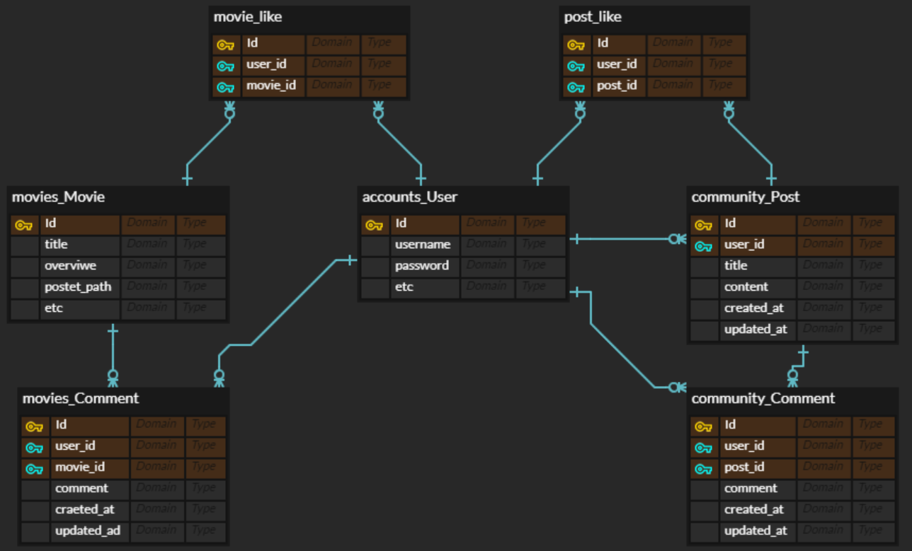
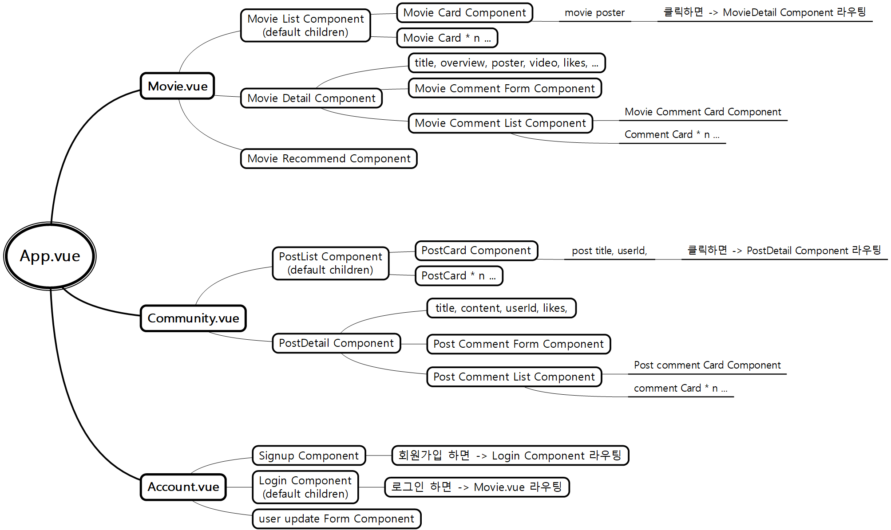

# Final Project - 영화 추천 페이지 만들기


## 1. PPT (...기획......;; 초초초초 간략)

[google sheet](https://docs.google.com/presentation/d/1RvIF_9Ck6xDtpFSgp0mAvlZCa06VRVh04FstW-k7dxQ/edit?ts=60a36d48#slide=id.gd9446e4414_1_14)


## 2. ERD (Model)




## 3. API URL

1. movies app

| HTTP verb  | URL 패턴                                | 설명                                  |
| ---------- | --------------------------------------- | ------------------------------------- |
| GET        | movies/                                 | 전체 영화 목록 조회 페이지            |
| GET        | movies/recommend/                       | 영화 추천 페이지                      |
| GET        | movies/<movie_id>/                      | 영화 상세(detail) 페이지              |
| GET & POST | movies/<movie_id>/likes/                | 좋아요 상태 조회 / 영화 좋아요 / 취소 |
| GET & POST | movies/<movie_id>/comment/              | 영화 댓글 조회 / 영화 댓글 생성       |
| PUT        | movies/<movie_id>/comment/<comment_id>/ | 영화 댓글 수정                        |
| DELETE     | movies/<movie_id>/comment/<comment_id>/ | 영화 댓글 삭제                        |


2. community app

| HTTP verb  | URL 패턴                                  | 설명                         |
| ---------- | ----------------------------------------- | ---------------------------- |
| GET        | community/                                | 전체 게시글 목록 조회 페이지 |
| POST       | community/                                | 게시글 생성                  |
| GET        | community/<post_id>/                      | 게시글 상세(detail) 페이지   |
| PUT        | community/<post_id>/                      | 게시글 수정                  |
| DELETE     | community/<post_id>/                      | 게시글 삭제                  |
| POST       | community/<post_id>/likes/                | 게시글 좋아요 / 취소         |
| GET & POST | community/<post_id>/comment/              | 게시글 댓글 조회 / 댓글 생성 |
| PUT        | community/<post_id>/comment/<comment_id>/ | 게시글 댓글 수정             |
| DELETE     | community/<post_id>/comment/<comment_id>/ | 게시글 댓글 삭제             |


3. Accounts

| HTTP verb | URL 패턴                 | 설명                          |
| --------- | ------------------------ | ----------------------------- |
| POST      | accounts/signup/         | 회원 가입                     |
| POST      | accounts/api-token-auth/ | 로그인 (JWT 얻기)             |
| -----     | -----                    | JWT 갱신 (공부해야함)         |
| GET       | accounts/<user_name>/    | 회원 정보 상세(detail) 페이지 |
| PUT       | accounts/<user_name>/    | 회원 정보 수정                |
| DELETE    | accounts/<user_name>/    | 회원 탈퇴                     |


## 4. 컴포넌트 구조




## * 각자 맡은 작업

영수: 백엔드 + 프론트엔드

보람: 프론트엔드 + HTML/CSS


## * 일정

- 0520 (목)

  - 기획 및 모델링 

- 0521 (금)

  - page 구조 잡기(vue) / 페이지별 필요한 데이터 확인 및 구현(django) / 모델링 완성

  - movie 페이지 디자인, signup, login 페이지 디자인

- 0524 (월)

  - movie detail, recommend, community 페이지 디자인
  - 페이지별 데이터 무조건 가져올 수 있어야 한다. (movie, community 일부 완료)

- 0525 (화)

  - community 마무리, recommend 아이디에이션, 로직 구현 (장르별 각각 1개씩 추천?)
  - 부족한 페이지 더 완성도 높이기
  - 아마 추가할 작업이 있을 것 같음...

- 0526 (수)

  - 댓글 수정, Movie Comment 한 계정당 하나씩만 달 수 있도록 
  - My page 
  - 댓글 평점 별 / 추천 카드 css 구현 / 무비리스트 filtering sorting css / My page css

- 0527 (목)

  - 인피니티 스크롤, ppt 및 발표준비

- 0528 (금)

  - 발표


## * 프로젝트 중 공부한 내용들


### Git

- 항상 git은 vsCode로 관리합시다. (conflict 났을 때 merge를 쉽게 할 수 있음)

- git 순서
  - git add .
  - git commit -m " ~~~ "
  - git pull (local에 수정된 내용이 있다면 pull 전에 commit을 해줘야 한다.)
  - git push (push 하기 전에 git repository에 pull할 게 있다면 pull 해줘야 한다.)

- pull 할 때 conflict(충돌) 발생한 경우 
  - merge 하고 
  - git add .
  - git commit -m "merge : ~~~~"
  - git push


### 직렬화 & 역직렬화

- 직렬화(serializing) : python data -> JSON

- 역직렬화(deserializing) : JSON -> python data

- ```python
  # django restframework에서 제공하는 ModelSerializer 사용했을 때
  
  # 직렬화 (serializing)
  movies = Movie.objects.all()	# Python data 형태 (QuerySet)
  serializer = MovieSerializer(movies, many=True) 	# DB의 Movie table에서 모든 table들을 꺼내 직렬화한다.(JSON 형태로 만들어 준다.)
  													# QuerySet인 경우 -> many=True 를 해줘야한다.
      												# 단순히 Model instance인 경우 -> X
  # 역직렬화 (deserializing)
  data = request.data	# JSON 형태
  serializer = MovieSerializer(data=data)	# JSON 형태의 데이터를 역직렬화한다. (Python data 형태로 만들어준다.)
  if serializer.is_valid():	# 유효성 검사
      serializer.save()	# 역직렬화된 데이터(Python data 형태)를 DB의 Movie table에 저장한다.
      # serializer.save(user=request.user) 	# user를 넣어줘야 하는 경우 바로 넣어줄 수 있다.
  # db 수정 한번에 하는 법
  movie = Movie.objects.get(pk=1)	# model instance
  data = request.data		# JSON 형태
  serializer = MovieSerializer(movie, data=data)	# movie를 수정 (data로)
  if serializer.is_valie():	# 유효성 검사
      serializer.save()	# 저장
  ```

- 궁금한 부분

  - 역직렬화 할 때 
    - JSON data를 여러개를 (배열 형태로) 받아왔다면, 저장하는 법이 다른가?
      - many=True를 써서 한번에 저장하나?
      - 아님 알아서 그냥 저장이 되나?
      - 아님 하나씩 꺼내서 저장을 해줘야 하나?


### API 요청 / JSON 파일 생성 / DB loaddata

- TMDB API에 요청을 보내서  JSON 데이터 받아오기
- .json 파일 생성, 받아온 JSON 데이터를 .json 파일에 저장하기
- .json 파일 DB에 loaddata하기

```python
import requests
import json


'''
get_movie_list.py를 실행하기 전에 이 파일을 실행해 주세요.

genre와 movie는 서로 mtm 관계설정이 되어있기 때문에, 
genre table을 먼저 만들어 둬야 movie 데이터를 가져올 때 문제가 발생하지 않습니다.
'''

URL = 'https://api.themoviedb.org/3'
# KEY 넣어주세요!
KEY = ''

url = f'{URL}/genre/movie/list?api_key={KEY}'
response = requests.get(url)
res_data = response.json()['genres']

data = []
for i in range(len(res_data)):
    genre = res_data[i]
    # DB에 넣을 수 있는 형태로 바꿔주기!
    tmp = {
        'model': 'movies.genre',
        'pk': genre['id'],
        'fields': {
            'name': genre['name']
        }
    }
    # print(tmp)
    data.append(tmp)


# 파일을 만들지 않아도 자동으로 생성해서 입력됩니다.
with open('movies.json', 'w') as f:
    json.dump(data, f, indent=4)
```

```python
import requests
import json
from pprint import pprint

'''
기존에 genre list를 저장한 movies.json에
movie list를 추가해서 다시 저장하게 됩니다.
get_genre_list.py 를 먼저 run 한 후, 이 파일을 실행해 주세요.

genre / movie JSON 파일을 별도로 만들어도 상관없습니다.
하지만 이 경우에는 DB에 loaddata 할 때, genre.json을 먼저 해야 합니다.

popular 영화를 얻어오는 요청경로를 이용했습니다.

사람마다 Movie Model이 다르게 정의되었을 수 있기 때문에, 필드명을 수정해줘야 할 수도 있습니다.
저는 TMDB에서 받아온 이름과 동일하게 필드명을 만들어줬습니다. (일부 필드는 삭제했습니다.)

movies.json 파일이 생성되면,
movies app에 fixtures 폴더를 생성하고, 해당 폴더로 movies.json을 이동시킨 후,
bash창에 아래 명령어를 입력합니다.
$ python manage.py loaddata movies/fixtures/movies.json 
'''

# 파일 열기 ! (genre 데이터만 있는 상태에서 movie 데이터 추가하기 위해)
with open('movies.json', 'r+') as f:
    data = json.load(f)
# pprint(data)

URL = 'https://api.themoviedb.org/3'
# KEY 넣어주세요!
KEY = ''    

page = 25   
# page : 1 ~ 500
# page당 data 20개
# popular/ 경로의 page는 최대 500 page 까지 되는거 같습니다. (총 10000개 data 얻을 수 있을 듯?)
for i in range(1, page + 1):
    url = f'{URL}/movie/popular/?api_key={KEY}&page={i}'
    response = requests.get(url)
    res_data = response.json()['results']  
    print(response.json()['page'])      # 진행 상황을 알기위한 출력 :)

    for j in range(len(res_data)):
        movie = res_data[j]
        # release_date 가 없는 경우도 있어서... 이 경우는 continue를 해줍니다!
        # poster_path가 없는 경우도 continue를 해줍니다!
        if not movie.get('release_date') or not movie.get('poster_path'): 
            print('release_date is not exist : continue')
            continue
        # DB에 넣을 수 있는 형태로 만들어 주기!
        movie.pop('backdrop_path')  # 필요없을 거 같은 필드라 삭제했습니다.
        movie.pop('video')          # 삭제
        movie['like_users'] = []    # 필드 추가 (like 기능구현을 위해 user와 mtm 관게 설정한 필드)
        tmp = {
            'model': 'movies.movie',
            'pk': movie.pop('id'),
            'fields': movie,
        }
        # pprint(tmp)
        data.append(tmp)

# 파일을 만들지 않아도 자동으로 생성해서 입력됩니다.
with open('movies.json', 'w') as f:
    json.dump(data, f, indent=4)
```

```bash
$ python manage.py loaddata movies/fixtures/movies.json  
```

